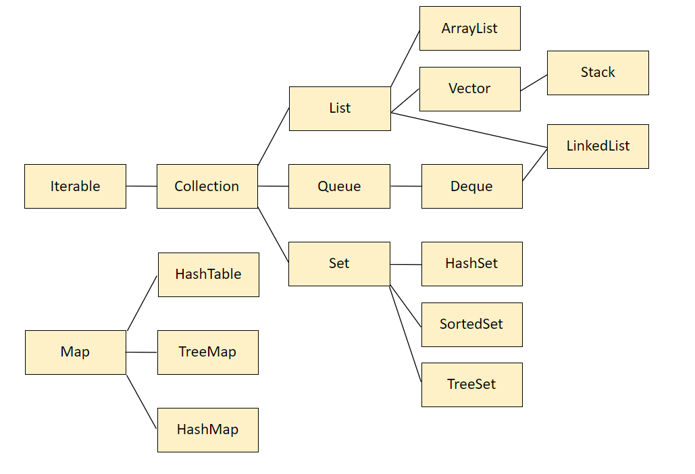
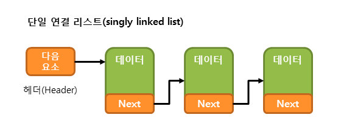
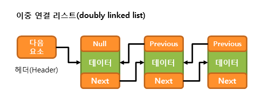

# Data Structure
### Java Collection 프레임워크 기반 자료구조

## List 컬렉션 클래스  
List 인터페이스를 구현한 모든 List 컬렉션 클래스는 다음과 같은 특징을 가집니다.

1. 요소의 저장 순서가 유지됩니다.
2. 같은 요소의 중복 저장을 허용합니다.  
-> List는 중복된 값을 삽입하는 것이 가능하고 인덱스 넘버를 통해 참조하고 관리된다.

대표적인 List 컬렉션 클래스에 속하는 클래스는 다음과 같습니다.

### ArrayList<`E`>

---
#### 중간 인덱스의 요소를 특정해서 삭제하면 해당 요소보다 뒤의 인덱스를 가진 요소들이 한 칸 씩 앞으로 당겨진다.

JDK 1.2부터 제공된 ArrayList 클래스는 내부적으로 배열을 이용하여 요소를 저장합니다.
ArrayList 클래스는 배열을 이용하기 때문에 인덱스를 이용해 배열 요소에 빠르게 접근할 수 있습니다.
하지만 배열은 크기를 변경할 수 없는 인스턴스이므로, 크기를 늘리기 위해서는 새로운 배열을 생성하고 기존의 요소들을 옮겨야 하는 복잡한 과정을 거쳐야 합니다.

물론 이 과정은 자동으로 수행되지만, **요소의 추가 및 삭제 작업에 걸리는 시간이 매우 길어지는 단점**을 가지게 됩니다. 

### LinkedList<`E`>

---
#### 특징 : 먼저 중간 인덱스에서 삭제가 이루어지면 해당 링크(L)와 서로 바라보던 L-1번 L+1번인덱스의 링크들과 연결을 끊고 -1, +1번 인덱스가 서로 다시 링크를 연결한다.
#### 실질적으로 리스트의 요소 사이의 빈공간 없이 관리되지만 원래 중간 링크가 가지고있던 인덱스 번호는 비어있게 된다. 이 특징 덕분에 높은 빈도의 삽입 삭제가 이루어 질 때 속도 측면에서 ArrayList보다 유리하다.

LinkedList 클래스는 ArrayList 클래스가 배열을 이용하여 요소를 저장함으로써 발생하는 단점을 극복하기 위해 고안되었습니다.
JDK 1.2부터 제공된 LinkedList 클래스는 내부적으로 연결 리스트(linked list)를 이용하여 요소를 저장합니다.

배열은 저장된 요소가 순차적으로 저장됩니다.
하지만 연결 리스트는 저장된 요소가 비순차적으로 분포되며, 이러한 요소들 사이를 링크(link)로 연결하여 구성합니다.
다음 요소를 가리키는 참조만을 가지는 연결 리스트를 단일 연결 리스트(singly linked list)라고 합니다.

이러한 단일 연결 리스트는 요소의 저장과 삭제 작업이 다음 요소를 가리키는 참조만 변경하면 되므로, 아주 빠르게 처리될 수 있습니다.
하지만 단일 연결 리스트는 현재 요소에서 이전 요소로 접근하기가 매우 어렵습니다.
따라서 이전 요소를 가리키는 참조도 가지는 이중 연결 리스트(doubly linked list)가 좀 더 많이 사용됩니다.

LinkedList 클래스도 위와 같은 이중 연결 리스트를 내부적으로 구현한 것입니다.
또한, LinkedList 클래스 역시 List 인터페이스를 구현하므로, ArrayList 클래스와 사용할 수 있는 메소드가 거의 같습니다. 

### Vector<`E`>

---
#### ArrayList와 완전히 똑같이 작동하되 멀티쓰레드를 통해 동시에 호출하는 것이 불가능하다. (스레드에 안전하다)
기존 코드와의 호환성을 위해서만 남아있으므로, Vector 클래스보다는 ArrayList 클래스를 사용하는 것이 좋습니다.

## Set

**Set은 저장 순서를 보장하지않고 중복을 허용하지 않는다. 중복 금지에선 null도 해당된다. 두 개 이상의 null값을 저장하지 않는다.**

Set의 종류

### HashSet

객체들을 순서없이 저장하고 hashcode를 통한 중복을 방지한다.

### TreeSet

Comparator 인터페이스를 이용해 삽입되는 값이 비교되면서 정렬된 자리로 들어가게된다.

### SortedSet

구현체가 없고 정렬된 셋을 다루기 위한 메서드들이 들어있는 인터페이스이다. 
TreeSet을 선언에 정렬된 리스트를 구성하고

headSet() : 가장 작은 값부터 인자로 넘긴값 직전까지의 요소들을 셋으로 리턴합니다.
tailSet() : 가장 큰 값부터 인자로 넘긴값까지 포함해서 요소들을 셋으로 리턴합니다.
subSet() : 인자로 넘긴 A와 B사이의 인자들을 셋으로 리턴합니다. A인자는 포함되고 B인자 직전까지의 요소들만 리턴됩니다.
가장자리 요소의 접근은 first(), last()

## Stack / Queue / Deque

스택(Stack)이나 큐(Queue)의 작동 구조를 몰라도 대부분의 사람들이 이해하고있는 선입선출(FIFO, 큐), 후입선출(LIFO, 스택) 개념이 적용된 자료구조이다.

컬렉션의 개념이 없는 프로그래밍 언어에서는 자바에서의 리스트와 같은 형태를 구현하는것보다. 스택이나 큐를 구현하여 상황에 맞게 사용하는것이 더 유리하지만,

자바에서는 List의 인덱스 참조 개념을 이용해 똑같이 동작하게 구현 할 수 있어서“특정 자료구조를 이용해 구현하도록 유도되는 문제를 풀어내야하는 경우나 극한의 효율성으로 최적화 해야하는 경우가 아니라면 거의 사용하지않는다.

데크(Deque)는 앞, 뒤 양방향에서 전부 삽입과, 추출이 가능하다. 바로 위의 구문 처럼 데크도 스택처럼 사용할 수도 큐처럼 사용할 수 도있다. 어차피 똑같은데 리스트를 쓰면 되는거 아닌가? 할 수 있지만,

데크를 사용하는 이유는 높은 빈도의 푸시, 팝 연산이 발생하는 경우에 리스트보다 좋은 성능을 보인다.

인덱스를 지정해서 값을 참조해야하는 연산이 존재하지않고 양 끝에서 삽입과 삭제 연산으로만 풀어가야하는 로직을 구현 할 때 사용하면 효율적이다.

### Stack

스택은 후입선출, LIFO(Last In First Out) 규칙을 지키는 자료구조이다.
#### 대표 메서드
+ push() : 인자로 넘어간 값을 스택의 맨 뒤에 삽입한다. 
+ pop() : 맨 뒤의 요소를 뽑아서 리턴 
+ peek() : 맨 뒤의 요소를 리턴 단, 삭제하지않고 요소만 복사해서 리턴함. 
+ empty() : 스택이 비어있는지 확인, 더 상위 개념의 isEmpty()사용을 추천. 

가장 대표적으로 완전 탐색의 DFS알고리즘을 구현하는데 사용한다.

깊이 우선으로 탐색하고 노드의 끝을 발견했을때 가장 마지막의 넣은 노드부터 탐색을 마치며 진행하기 때문이다.

### Queue

큐는 선입선출, FIFO(First In First Out) 규칙을 지키는 자료구조이다.
#### 대표 메서드
+ offer() : 인자로 넘어간 값을 큐의 맨 뒤로 삽입한다.
+ poll() : 맨 앞의 값을 뽑아서 리턴한다.
+ peek() : 맨 앞의 값을 복사해 리턴하되 삭제하지는 않는다.
+ element() : 맨 앞의 값을 복사해 리턴하되 삭제하지않고 위의 두 메서드와는 다르게 큐가 비어있을때
NoSuchElementException(그런 요소는 없어요 경고)을 리턴한다.
+ isEmpty() : 큐가 비어있는 지 확인한다.

### Deque
큐에서 좀 더 개선 된 자료구조로 데크가 있다.

스택과 큐는 한 방향에서만 입려과 출력이 가능하지만 (스택 → 삽입, 삭제 모두 한 방향에서만 가능, 큐 → 삽입 앞, 삭제 뒤 각각 한 방향) 데크는 양방향에서 모두 삽입, 삭제가 가능하다.
#### 대표 메서드
+ offerFirst(), offer() : 두 메서드로 양끝에서 삽입할 수 있다.
+ pollFirst(), poll() : 두 메서드로 양 끝에서 값을 리턴받고 삭제할 수 있다.
+ peekFirst(), peek() : 두 메서드로 양 끝에서 값을 복사해서 리턴 받을 수 있다.
+ isEmpty() : 큐가 비어있는 지 확인한다.

마찬 가지로 큐와 데크도 컬렉션에서 상속받기 때문에 컬렉션에서 지원하는 메서드들도 사용가능하다.
자바에서 큐와 데크는 구현체없이 인터페이스만 존재한다. LinkedList를 이용해 인스턴스를 생성하고 다형성을 이용해 큐와 데크로 객체 타입을 바꿔서 선언해 사용해야한다.
> Queue<Integer> que = new LinkedList<>();  
Deque<Integer> dq = new LinkedList<>();

가장 대표적으로 완전탐색의 BFS알고리즘을 구현하는데 사용한다.

너비 우선으로 탐색하고 그래프나 트리의 다음 레벨로 이동할 때 먼저 탐색한 순서대로 poll하면서 해당 노드와 연결된 다음 노드들을 탐색한다.

## Map

### HashMap

Key와 Value 형태로 데이터를 관리하는 자료구조로 인덱스 대신 key통해 값을 참조하는 방식의 자료구조이다.

Key는 저장 순서를 보장하지않고 중복도 허용하지않는다 Set과 같은 특징을 가진다 Key와 매핑되기때문에 Value 또한 순서를 보장하지는 않지만 중복은 허용된다.

또 멀티스레드의 개념에서 동기화를 지원하지 않는다. (스레드에 안전하다.)

### HashTable

해시 테이블은 해시 맵보다 조금 더 복잡한 개념이다. 키 와 밸류가 바로 매핑되는 것이아니라 해시 함수를 통해서 해시값을 생성하고 해시값과 키를 매핑하여 해시 값을 주소값처럼 사용해 검색에 용이하게 만든 자료구조이다.